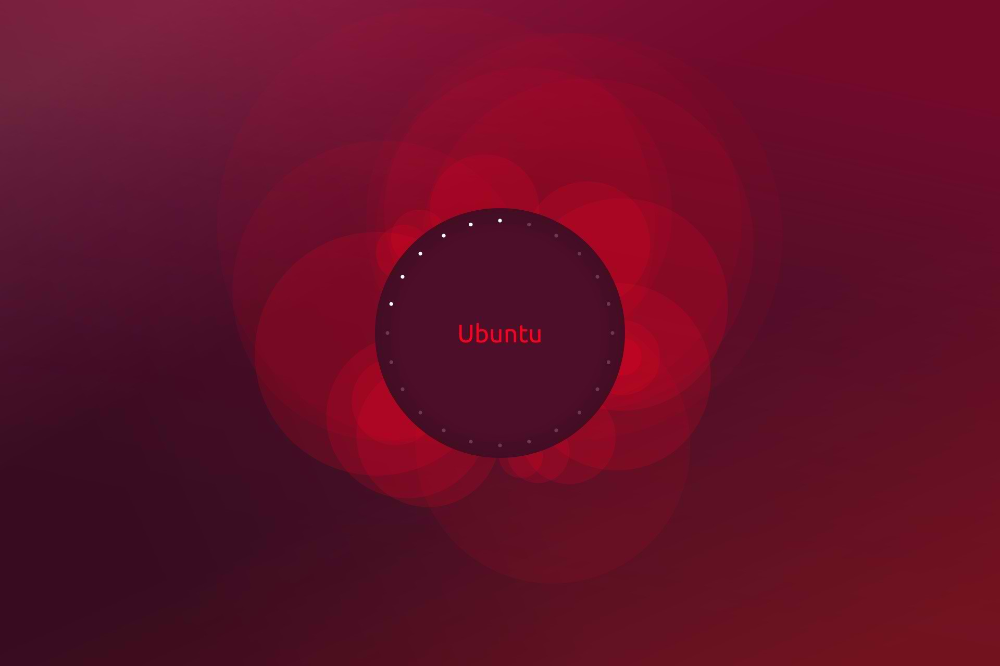

# Pertemuan Delapan: Bantuan dan Manajemen Software di Linux

## Outline

- [Bantuan di Linux](#bantuan-di-linux)
  - [Help](#help)
  - [Man](#man-(manual-page))
  - [Option --help]()
  - [Info](#info)
- [Manajemen Software](#manajemen-software)
  - [Ubuntu Software Center](#ubuntu-software-center)
  - [Apt](#apt)
  - [DPKG](#dpkg)
  - [Repository](#mengubah-server-repository)
- [Challenge](#challenge)

## Bantuan di Linux

Dalam menggunakan Linux kita sering mengalami kendala terhadap suatu perintah.

Untuk mendapatkan bantuan di Linux dapat menggunakan perintah:

- `help`.
- `man`.
- option `--help`.
- `info`.

Kita juga dapat mendapatkan bantuan dari luar sistem Linux seperti HOWTO, forum diskusi, dan komunitas di Linux.

## Help

#### Teori

Help digunakan untuk mendapatkan bantuan dari perintah internal shell.

#### Praktikum

Menampilkan daftar perintah internal shell:

- `help`

Menampilkan informasi lengkap dari perintah pwd:

- `help pwd`

## Man (Manual page)

#### Teori

Setiap perintah di Linux menyertakan bantuan yang disebut manual page.

Sintaks: `man [OPTION] [[SECTION] PAGE]`

Keterangan:

- OPTION:
  - `-k keyword` : menampilkan halaman manual sesuai keyword.
  - `-a` : menampilkan seluruh halaman info yang sesuai.
  - `-w` : menampilkan lokasi direktori dari halaman info.
- PAGE: nama halaman manual.

#### Praktikum

Melihat halaman manual dari perintah mkdir:

- `man mkdir`

Menampilkan daftar perintah yang berkaitan dengan password:

- `man -k password`

## Option --Help

#### Teori

Selain man, bantuan perintah juga dapat ditampilkan dengan menambahkan option `--help` pada setiap perintah.

Tidak semua perintah menyediakan option ini

#### Praktikum

Melihat bantuan atau dokumentasi dari perintah ls:

- `ls --help`

Melihat bantuan dari perintah mkdir:

- `mkdir --help`

## Info

#### Teori

Untuk melihat informasi yang lebih lengkap dari suatu perintah disediakan info pages atau halaman informasi.

Halaman info dibuat untuk program yang dikembangkan oleh proyek GNU.

#### Praktikum

Melihat daftar perintah yang memiliki info page:

- `info`

Melihat info pages dari perintah ls:

- `info ls`

## HowTo

#### Teori

HOWTO adalah salah satu dokumentasi yang digunakan dari luar Linux.

HOWTO berisi dokumentasi yang berkaitan dengan kasus tertentu.

Versi HOWTO dapat ditemukan di situs Linux Documentation Project yang beralamat di [tldp.org](tldp.org).

#### Praktikum

Mencari dokumentasi penggunaan DSL:

- Buka Google.
- Searcing: `DSL HOWTO`

## Manajemen Software

Ubuntu menggunakan package manager atau sistem manajemen paket yang disebut `apt` (Advance Packaging Tool) untuk mengelola software.

Package manager `apt` memiliki database software yang disebut repositori.

Untuk mengakses repositori dapat menggunakan tools Ubuntu Software Center yang berbasis GUI dan `apt` yang berbasis CLI.

Selain menggunakan package manager `apt`, untuk menginstall software secara manual dapat dilakukan dengan perintah `dpkg`.

## Ubuntu Software Center

#### Teori

Ubuntu Software Center adalah aplikasi GUI untuk mengelola software.

Ubuntu Software Center bisa diibaratkan seperti Play Store di Android.

#### Praktikum

**Install Software**

- Buka Ubuntu Software Center melalui pencarian.
- Cari aplikasi VLC.
- Klik tombol Install.

**Uninstall Software**

- Buka Ubuntu Software Center melalui pencarian.
- Cari aplikasi VLC.
- Klik tombol Remove.

## APT

#### Teori

Apt atau Apt-get adalah aplikasi CLI (Command Line Interface) untuk mengelola software.

#### Praktikum

Update, Upgrade, dan Dist-Upgrade

- `sudo apt update` : Memperbarui informasi software.
- `sudo apt upgrade`: Menginstall software terbaru.
- `sudo apt dist-upgrade`: Menginstall sistem/kerbaru terbaru.

Install VLC:

- `sudo apt install vlc`

Download VLC tanpa install:

- `sudo apt download vlc`

Uninstall VLC:

- `sudo apt remove vlc` atau `sudo apt purge vlc`

## DPKG

#### Teori

DPKG (Debian Package Manager) adalah perintah yang digunakan untuk mengelola software berbasis debian dan file yang memiliki ekstensi `.deb`.

#### Praktikum

Download Teamview (.deb):

- [Teamviewer](https://www.teamviewer.com/en/download/linux/)

Install Teamviewer:

- `sudo dpkg -i nama-software.deb`

Uninstall Teamviewer

- `sudo dpkg -r teamviewer`

## Mengubah Server Repository

#### Teori

Repository merupakan tempat disimpannya semua paket software atau disebut database.

Daftar repository yang digunakan `apt` disimpan di file /etc/apt/source.list.

Untuk mengatur repository dapat dilakukan 2 cara:

- Mengedit secara langsung file /etc/apt/source.list
- menggunakan tools Software & Update yang berbasis GUI.

#### Praktikum

- Buka `Software & Update` atau `Software` di pencarian.
- Klik bagian `Download From`, lalu pilih `Other`.
- Pilih Repository yang diinginkan atau pilih Best Server.
- Klik `Choose Server`.

## Challenge

#### Ketentuan Challenge

- Challenge no 1-5 harus menggunakan Screenshot.
- Challenge dikumpulkan di Elen.

#### Challenge

1. Jalankan perintah `whoami`, `hostname`, dan `date` secara bersamaan.
2. Tuliskan perintah halaman manual dari
   1. perintah `crontab`
   2. perintah yang berkaitan dengan `process`
3. Tampilkan halaman info dari perintah `date`.
4. Tuliskan perintah menginstall GIMP melalui perintah `apt`.
5. Download software apapun yang berekstensi `.deb` melalui internet lalu jalankan:
   1. Perintah menginstall software tersebut.
   2. Perintah menguninstall software tersebut.
6. Jelaskan:
   1. Apa perbedaan Ubuntu Software Center, `apt`, `dpkg`.
   2. Kapan `apt` dan `dpkg` digunakan?